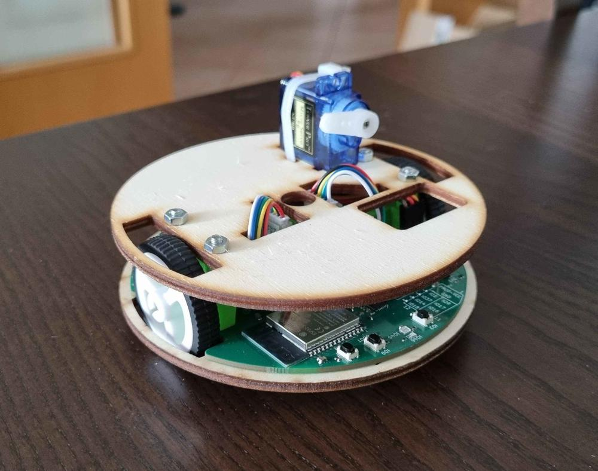

# Robotický tábor

Hlavním výrobkem letošního tábora je [Robůtek V2](https://robutek.robotikabrno.cz/v2/)

[Dokumentace](https://robutek.robotikabrno.cz/v2/){ .md-button .md-button--primary }

 
Minulý rok byl [Robůtek V1](https://robutek.robotikabrno.cz/v1/), ale tento rok mu přibylo dost nových funkcí a rozšíření.
- RGB senzor zespod Robůtka + přidavný RGB senzor na modulu
- Lepší přesnost motorů

 
Programuje se stejně jako minulý rok v TypeScriptu s pomocí Jacula ([jaculus.org](https://jaculus.org))

[Lekce](https://robutek.robotikabrno.cz/v2/robot){ .md-button }

 
Tento rok sice nemáme nové pájecí výrobky, ale všechny pájecí výrobky z minulých let si můžete stále vyrobit.

[Pájecí výrobky](https://gadgets.robotikabrno.cz/){ .md-button .md-button--primary }

## Rozcestník lokálních adres

- [files.lan](http://files.lan/) - lokální verze souborů
- [navod.lan](http://navod.lan/) - stejně jako 2025.robotickytabor.cz
- [robutek.lan](http://robutek.lan/) - stejně jako robutek.robotikabrno.cz
- [smd-challenge.lan](http://smd-challenge.lan/) - stejně jako smd-challenge.robotikabrno.cz
- [gadgets.lan](http://gadgets.lan/) - stejně jako gadgets.robotikabrno.cz